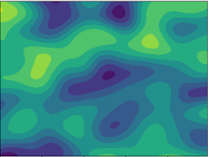
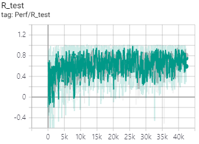

This is **very naive** implementation of [Learning to Learn without Gradient Descentby Gradient Descent](https://arxiv.org/abs/1611.03824) with **A3C**.

### Tasks
5000 tasks(scale0.1_wh50_5000.p, scalerand_wh50_5000.p) are instantiated from gaussian process(2dim.) with fixed scale(0.1) and random scale([0.01,0.61)).

These tasks are 50 X 50 and minmax normalized([-1,1])

Each instance(task) looks like

4900 episodes for training / 100 episodes for test

### A3C agent
- Agent
	- is 2 layer LSTM.
	- has continuous output (beta distribution).
	- gets output & reward of previous step as input.
	

---
- Each agent chooses one task from 4900 training tasks randomly at the start of episode
- Similarly, each agent chooses one task from 100 test tasks randomly at test episode.

# Dependencies
- tensorflow==1.13.2
- scikit-learn==0.21.3

# Training
	python main_a3c_gp_meta.py

